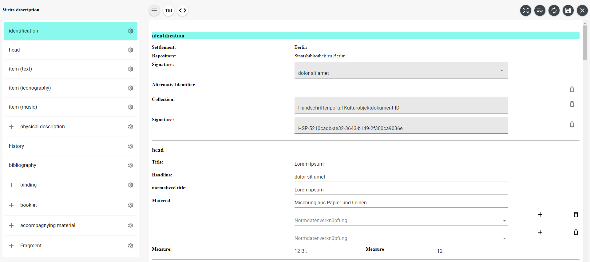

# Handschriftenportal - Editor for Manuscript Description -

**Description**: This tool offers the possibility to take up the description of a book manuscript within the browser.
The description is structured along
the [DFG guidelines](http://bilder.manuscripta-mediaevalia.de/hs//kataloge/HSKRICH.htm). Descriptions can be converted
to [TEI XML](https://tei-c.org/). This software module is part of the administration unit of the manuscripts
portal "[Handschriftenportal](https://handschriftenportal.de/)".

- **Technology stack**:
  - The project depends on `nodejs` in version 16+ and `npm` in version 8+
  - The implementation is based on the React Javascript library.
  - Additionally the UI component library react-material UI is used.
  - The rich text manipulation is based on the Javascript Rich-Text Editor
    Framework [Slate](https://docs.slatejs.org/). To build the project npm and webpack is used.
- **Status**: Alpha (in development)
- **Links:** [Production instance](https://erfassung.handschriftenportal.de/dashboard.xhtml)
- Describe what sets this apart from related-projects. Linking to another doc or page is OK if this can't be expressed
  in a sentence or two.

## Getting started

1. Get the source code

   ```shell
   git clone https://github.com/handschriftenportal-dev/hsp-erfassung
   ```

2. Start the server

   ```shell
   npm run start
   ```

3. Open the editor within the browser at http://localhost:8080/

Afterwards you can start editing the template TEI XML file.

## Configuration

The configuration of the editor is based on a HTML API within the index.html file.

```html
<div
  id="hsp-erfassungseditor"
  data-url="http://localhost:8080/tei-HSP-neu.xml"
  data-validation-url="https://erfassung.handschriftenportal.de/rest/beschreibungen/validate"
  data-workspace-url="https://erfassung.handschriftenportal.de/rest/beschreibungen/"
  data-normdaten-url="http://normdaten.staatsbibliothek-berlin.de:9299/rest/graphql/"
  data-start-in-read-only="false"
  data-enable-hsp-tool-bar="true"
  data-language="de"
  data-standalone="true"
></div>
```

The following table describes the configuration parameter.

| Parameter                | Description                                                                                     |
| ------------------------ | ----------------------------------------------------------------------------------------------- |
| data-url                 | The public URL to an TEI XML File. This file will be shown within the editor.                   |
| data-validation-url      | The public REST Endpoint for XML Schema validation.                                             |
| data-start-in-read-only  | Possibility to start the editor in edit or read mode.                                           |
| data-enable-hsp-tool-bar | Possibility to activate or deactivate the toolbar.                                              |
| data-language            | Switch the label language. Possible values are de or en                                         |
| data-standalone          | Possibility to start the editor in standalone (without Handschriftenportal) or integration mode |
| data-workspace-url       | Data URL for preview feature of workspace                                                       |
| data-normdaten-url       | The public URL fetching meta data in GND Ontologie format.                                      |

## Usage

The usage of the editor is relatively simple. You can control data capturing with the following three elements of the
editor:

- The toolbar for action related to the whole document
- The sidebar for manipulation of the document structure
- The rich text editing field for text and value/reference manipulation



**Image 1:** Editor in edit mode

On top you can find the toolbar with the following functions (from left to right):

- Show text mode
- Show TEI XML
- Show TEI Header
- Open Fullscreen
- Start XML schema validation
- Reload data
- Save as TEI XML file
- Switch to write or read mode

On the left side you can see the sidebar displaying the structure of the document. Each component within the structure
can be manipulated using the respective settings button.

In the middle you can see the editing section for each component.

## How to test the software

1. To run all unit tests please use the following command

   ```shell
   npm run test
   ```

## Further scripts

The list of supported special characters can be exported into a csv file using

```shell
npm run sonderzeichen-export
```

To scan a folder of xml files for used (special) characters in text, use

```shell
npm run analyse <path/to/folder>
```

To create the special character map run:

```shell
npm run create-sonderzeichen-map <proxy-url>
```

## Known issues

## Getting help

To get help please use our contact possibilities on
[Mastodon](https://openbiblio.social/@hsprtl),
[Bluesky](https://bsky.app/profile/hsprtl.bsky.social)
and [handschriftenportal.de](https://handschriftenportal.de/)

## Getting involved

To get involved please contact our development team
[handschriftenportal@sbb.spk-berlin.de](mailto:handschriftenportal-dev@sbb.spk-berlin.de)

## Open source licensing info

The project is published under the [MIT License](https://opensource.org/licenses/MIT).

## Credits and references

1. [Github Project Repository](https://github.com/handschriftenportal-dev)
2. [Project Page](https://handschriftenportal.de/)
